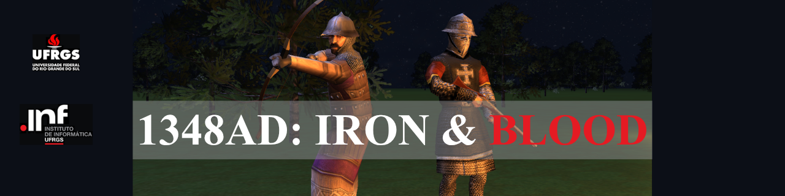

# Computação Gráfica e Visualização I (INF01047) - INF/UFRGS

# 1348AD: IRON & BLOOD

## 👥 Integrantes do Grupo
* **Caetano Meneghetti (00591004)**
* **Fernando Tedesco (00591001)**

## 📝 Descrição do Projeto
**1348AD: IRON & BLOOD** é um jogo de estratégia no estilo *Tower Defense* ambientado no período medieval. O objetivo central do software consiste no gerenciamento de recursos para a defesa de uma fortificação contra ondas progressivas de inimigos (tematicamente caracterizados como mutações decorrentes da Peste Bubônica). 

A dinâmica de jogabilidade envolve a aquisição, posicionamento estratégico e o aprimoramento (*upgrade*) de unidades militares, desafiando o usuário a expandir seu exército para sobreviver aos cenário de história alternativa proposto.

## 📚 Contexto Acadêmico

Este repositório contém o código base para o trabalho final. O enunciado completo do trabalho final está no Moodle:

https://moodle.ufrgs.br/mod/assign/view.php?id=6018620

# Guia de Extração de Assets: Total War: Medieval II

Esta seção detalha o processo passo a passo para extrair modelos 3D (`.mesh`) e texturas (`.texture`) dos arquivos originais do jogo *Total War: Medieval II*, convertendo-os para formatos editáveis modernos.

> **Aviso Legal:** Os *assets* extraídos são propriedade intelectual da SEGA e da Creative Assembly. Este guia destina-se estritamente à criação de modificações (*mods*) dentro do ecossistema do jogo ou para uso pessoal e educacional. É expressamente proibida a redistribuição pública destes arquivos originais.

---

## 🛠️ Pré-requisitos

Antes de iniciar o processo de extração, certifique-se de ter os seguintes itens:

1. **Cópia Legítima do Jogo:** Adquira o jogo através da plataforma Steam ou possua a mídia física original instalada em sua máquina.
2. **Software IWTE (v25_10_A ou superior):** Baixe a ferramenta oficial da comunidade *Total War*.
   - 🔗 **Link para Download:** [Fóruns da TWCenter - IWTE](https://www.twcenter.net/resources/iwte.2741/)
3. **Software de Modelagem 3D:** Recomendamos o uso do [Blender](https://www.blender.org/) (gratuito e de código aberto) para a montagem final.

---

## 📂 Passo a Passo da Extração

### 1. Desempacotando os Arquivos Base
Os arquivos do jogo vêm compactados. Para acessá-los, você deve usar a ferramenta oficial fornecida pelos desenvolvedores:
- Navegue até a pasta de ferramentas do seu jogo (geralmente localizada em `steamapps\common\Medieval II Total War\tools\unpacker`).
- Execute o arquivo `unpack_all.bat`.
- Aguarde o processo finalizar. Isso criará uma nova pasta chamada `data` no diretório principal do jogo, contendo todos os arquivos binários `.mesh` (modelos 3D) e `.texture` (texturas).

### 2. Configurando o IWTE
- Extraia e execute o aplicativo **IWTE**.
- Na interface principal, localize a opção de formato de saída (*output extension*) e defina-a preferencialmente como **`.glb`** (formato glTF, altamente compatível com softwares modernos).

### 3. Convertendo Modelos 3D (`.mesh` para `.glb`)
- No menu do IWTE, selecione a opção **`Mesh to extract`**.
- Navegue até a pasta `data` do jogo e selecione o arquivo `.mesh` que você deseja converter.
- O arquivo convertido estará pronto para uso e será salvo automaticamente dentro da pasta do IWTE, em um subdiretório chamado `to_extract`.

### 4. Convertendo Texturas (`.texture` para `.dds`)
- Retorne ao menu principal do IWTE e acesse **`imagefiles`** > **`.texture`**.
- Selecione o arquivo `.texture` correspondente ao seu modelo.
- A ferramenta extrairá a imagem e a converterá para o formato de superfície DirectDraw (**`.dds`**). O arquivo resultante será salvo na pasta `IWTEsave`.

### 5. Montagem e Mapeamento UV no Blender
- Abra o seu software 3D (ex: **Blender**).
- Importe o modelo convertido (`.glb`) e carregue a textura gerada (`.dds`) como o material do objeto.
- Acesse a área de **UV Editing** (Edição UV). Translace e ajuste o mapeamento UV do modelo para que ele se alinhe perfeitamente à área correta da textura.
  > 💡 **Nota de Modding:** Em *Total War*, é comum que um único arquivo de textura contenha "fatias" visuais para várias variações de armaduras, escudos ou rostos de uma mesma unidade. Mova as ilhas UV para a variação que você deseja aplicar.

### 6. Exportação Final
- Após concluir os ajustes de mapeamento, rig ou geometria, selecione seu modelo no Blender.
- Vá em `File > Export` e exporte o modelo finalizado para a sua extensão de trabalho preferida (como `.fbx`, `.obj` ou manter em `.glb`). O arquivo agora está pronto para ser implementado no seu projeto.