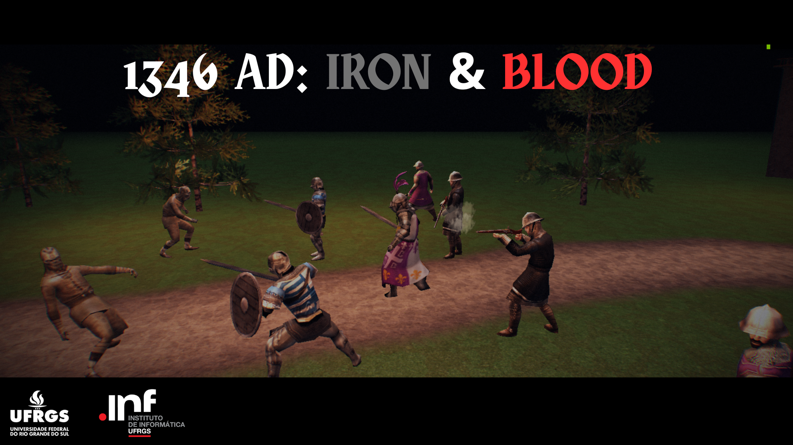
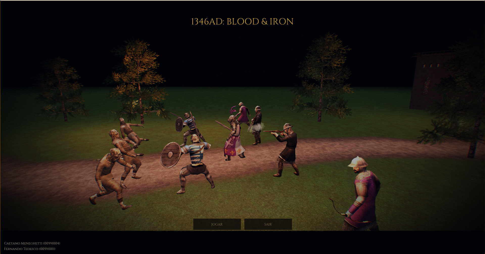
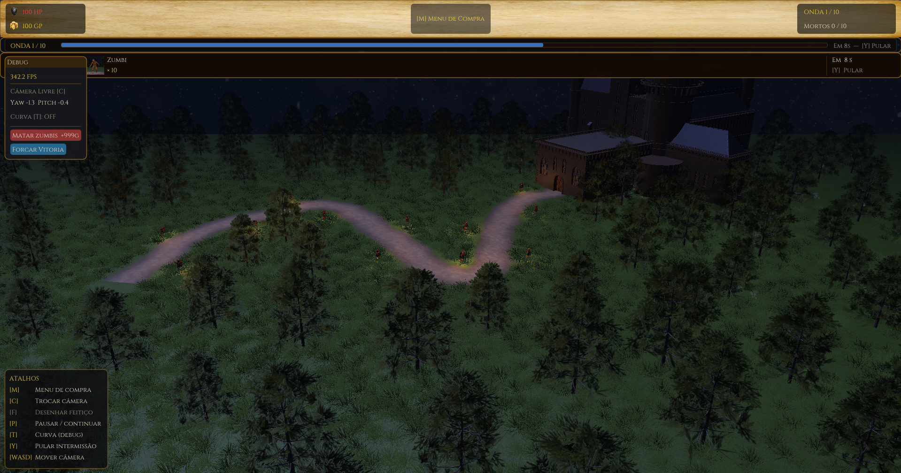
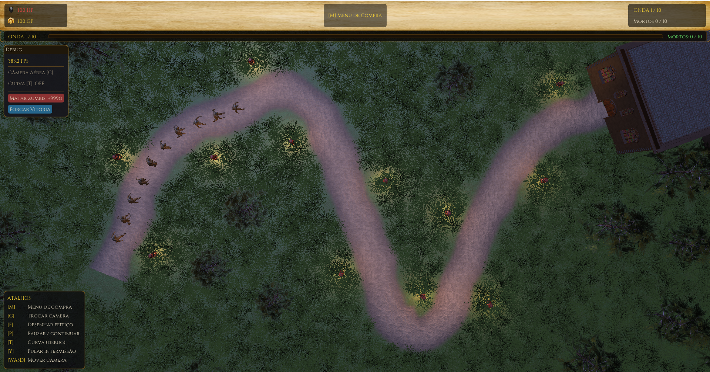
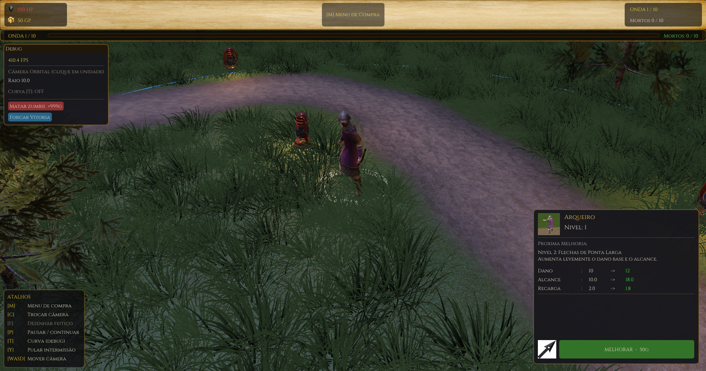

# Computação Gráfica e Visualização I (INF01047) - INF/UFRGS



# 1346AD: IRON & BLOOD

## 👥 Integrantes do Grupo
* **Caetano Meneghetti (00591004)**
* **Fernando Tedesco (00591001)**

## 📝 Descrição do Projeto
**1346AD: IRON & BLOOD** é um jogo de estratégia no estilo *Tower Defense* ambientado no período medieval. O objetivo central do software consiste no gerenciamento de recursos para a defesa de uma fortificação contra ondas progressivas de inimigos (tematicamente caracterizados como mutações decorrentes da Peste Bubônica).

A dinâmica de jogabilidade envolve a aquisição, posicionamento estratégico e o aprimoramento (*upgrade*) de unidades militares, desafiando o usuário a expandir seu exército para sobreviver aos cenário de história alternativa proposto.

## 📚 Contexto Acadêmico

Este repositório contém o código base para o trabalho final. O enunciado completo do trabalho final está no Moodle:

https://moodle.ufrgs.br/mod/assign/view.php?id=6018620

## 👥 Contribuições de Cada Membro

Fizemos uma divisão não muito rígida onde um membro (Caetano) ficaria mais responsável pela parte de iluminação, curvas, feitiços (canvas e CNN) e mapa e o outro membro (Fernando) ficaria mais envolvido com a extração e animação dos modelos, colisões, definição e upgrades das entidades (projéteis) e balanceamento do jogo. Aspectos relacionados a HUD, combate e lógica geral do jogo envolveram contribução parecida por parte dos dois membros.

## 🤖 Uso de Inteligência Artificial

Utilizamos a ferramenta de IA Claude para gerar código, esclarecer dúvidas referentes à sintaxe do C++ e do OpenGL e ajudar a debugar o código. Para gerar código, a ferramenta foi utilizada, principalmente, para (i) erros pequenos e refinamento após uma implementação parcial; (ii) implementação total de trechos que envolviam bibliotecas pouco familiares (como entendimento e uso de algumas das funções do OpenGL, Dear ImGui, Assimp, etc.); (iii) trechos de código mais complexos/extensos. O grupo buscou ao máximo passar prompts completos e com ideias prontas para que a IA ficasse responsável apenas pela parte da escrita do código, e não pela tomada de decisão do que foi feito, até como forma de manter o entendimento do que estava sendo implementado.

Organizamos a declaração de uso de ferramentas de IA de duas formas: (i) nos commits que continham praticamente todo o código gerado pela ferramenta, utilizamos "PROMPT:" no começo do commit e usamos a extensão do commit para colocar o prompt exato que foi usado; (ii) criamos um arquivo PROMPTS.md onde colocamos o prompt usado e o resultado. Note que não colocamos exatamente o código resultante, pois na grande maioria dos casos nós alteramos o código após ele ser gerado, seja a lógica de funcionamento dele ou coocando comentários, então preferimos colocar as funções ou arquivos que o agente mexeu/gerou trechos. Além disso, funções ou trechos do código informados podem ter ficado obsoletos ao longo do tempo, então considere que pode ser necessário retornar ao commit em que aquele prompt foi criado em PROMPTS.md para ver o que era aquele trecho de código quando foi criado.

Sobre a utilidade da IA, ela se mostrou muito útil para gerar código em que ela recebia uma descrição clara e extensa do que deveria ser feito. Contudo, percebemos que era prejudicial dar muita liberdade de tomada de decisão para ela, pois perdíamos um pouco do entendimento do código e isso era ruim a médio/longo prazo. Portanto, evitamos ao máximo isso. Foi interessante, também, para experimentarmos o nível que as ferramentas de inteligência articial se encontram -- no que são boas e no que são ruins.

Vale destacar que ambos os integrantes do grupo já tinham experiência implementando jogos 3D -- inclusive com OpenGL --, o que facilitou muito para reciclar ideias, reciclar trechos de códigos, reconhecer padrões de erros, entre outros aspectos.

## 📸 Screenshots






## 🎮 Manual de Utilização

### Começando
O jogo abre em **tela cheia**. Você cai no **menu principal**: clique em **JOGAR** para começar ou **SAIR** para fechar. Em seguida vem a **tela de seleção de general** — use as **setas ← →** (ou os botões na tela) para escolher e clique em **INICIAR** para entrar na partida (ou **VOLTAR** para o menu).

### Câmeras
O jogo tem três câmeras:
- **Livre (FPS):** padrão. Você anda pelo cenário com o mouse olhando em volta.
- **Aérea:** vista de cima, ideal para visão geral e para desenhar feitiços.
- **Orbital:** ativada automaticamente ao clicar em uma unidade sua; gira em torno dela.

Aperte **C** para alternar entre Livre e Aérea. Para sair da Orbital, clique com o **botão direito** (que também desseleciona a unidade).

### Jogabilidade
- **Comprar e posicionar tropas:** abra o **menu de compra** com **M**. Escolha uma unidade; o jogo entra no modo de posicionamento e mostra um "fantasma" que segue o mouse. Ele fica **azul** onde a colocação é válida e **vermelho** onde não é (em cima do caminho ou longe demais dele). Clique com o **botão esquerdo** para confirmar (desconta ouro) ou com o **direito** para cancelar.
- **Selecionar e melhorar (upgrade):** clique com o **botão esquerdo** em uma tropa já posicionada para selecioná-la (a câmera vai para o modo orbital e abre o painel de detalhes). No painel você vê os atributos e pode comprar o próximo nível, até o nível 5.
- **Feitiços:** primeiro compre cargas de feitiço no menu de compra (**M**). Os feitiços só podem ser desenhados na **câmera aérea**. Aperte **F** para entrar no modo de desenho, segure o **botão esquerdo** para desenhar a forma e aperte **Enter** para lançar (ao confirmar, o jogo sai do modo de desenho automaticamente). As formas reconhecidas são: **círculo** (veneno), **quadrado** (lentidão) e **triângulo** (metade da vida). Se você desenhar um feitiço sem ter carga dele, a forma **pisca em vermelho** como aviso.
- **Ondas:** os inimigos chegam em **10 ondas** progressivamente mais difíceis. Entre uma onda e outra há um intervalo (intermissão) com a prévia da próxima onda; aperte **Y** para pular a espera e começar logo.
- **Pausar:** aperte **P** a qualquer momento para pausar/retomar (congela o jogo inteiro).
- **Objetivo e fim de jogo:** defenda o castelo — cada inimigo que chega ao fim do caminho tira vida sua. Se a vida zerar, é **derrota**; sobreviver às 10 ondas é **vitória**. Nos dois casos aparece uma tela de fim que volta ao menu sozinha após alguns segundos (ou aperte **Y** para voltar na hora).

### Resumo dos atalhos

| Tecla / Botão | Ação |
| :--- | :--- |
| **W A S D** | Mover a câmera (anda na Livre, gira na Orbital, faz pan na Aérea) |
| **Mouse** | Olhar em volta (câmera Livre) |
| **Espaço / Shift** | Subir / descer (câmera Livre) |
| **Scroll do mouse** | Aproximar / afastar (câmera Orbital) |
| **C** | Trocar câmera (Livre ↔ Aérea) |
| **M** | Abrir/fechar o menu de compra |
| **F** | Desenhar feitiço (só na câmera aérea) |
| **Enter** | Confirmar/lançar o feitiço desenhado |
| **P** | Pausar / retomar o jogo |
| **Y** | Pular a intermissão entre ondas / voltar ao menu na tela de fim |
| **T** | Mostrar/esconder a curva do caminho (debug) |
| **Botão esquerdo** | Selecionar tropa / confirmar posicionamento / desenhar feitiço |
| **Botão direito** | Cancelar posicionamento / sair da câmera orbital |
| **Esc** | Fechar o jogo |

## ⚙️ Compilação e Execução

O projeto usa **CMake**. As bibliotecas GLFW, GLM, Dear ImGui e miniaudio já vêm junto no repositório; o **Assimp** é baixado automaticamente pelo CMake na primeira configuração, então a primeira compilação precisa de **conexão com a internet** e demora um pouco mais.

> ⚠️ **Assets (modelos 3D e texturas).** A pasta `data/` não está neste repositório por questão de direitos de imagem: os modelos e texturas são propriedade intelectual da SEGA / Creative Assembly (extraídos do *Total War: Medieval II*), e sua redistribuição pública é proibida. Por isso ela é mantida em um repositório **privado** separado, **[`1346AD-tower-defense-assets`](https://github.com/FernandoTedesco/1346AD-tower-defense-assets)**.
>
> Para rodar o jogo completo, basta obter a pasta `data/` desse repositório e colocá-la na raiz do projeto (ao lado de `src/`, `include/` e `CMakeLists.txt`). O acesso é concedido **mediante solicitação**. Como alternativa, é possível extrair os assets manualmente do jogo original seguindo o guia mais abaixo.

### Linux
No terminal, dentro da pasta do projeto:

```bash
cmake --workflow --preset configure-build-run
```

Isso configura, compila e executa de uma vez. Se preferir passo a passo:

```bash
cmake -B build -S .           # configura
cmake --build build           # compila
cmake --build build -- run    # executa
```

### Windows
A forma mais simples é pelo **VSCode**:
1. Instale o **VSCode**, um compilador **GCC (MinGW)** e o **CMake**.
2. Instale as extensões `ms-vscode.cpptools` e `ms-vscode.cmake-tools` (o VSCode sugere automaticamente ao abrir o projeto).
3. Clique no botão **Play** na barra inferior. Na primeira vez, escolha o compilador GCC quando for perguntado.

Pela linha de comando também funciona:

```bash
cmake -B build -S .
cmake --build build
```

O executável é gerado em `bin/Debug/main.exe` (a pasta `data` é copiada para o lado dele automaticamente). Para rodar, use o script `scripts\run.bat` ou execute o `.exe` diretamente. O jogo abre em **tela cheia**; use **Esc** para sair.

> Instruções mais detalhadas (dependências por sistema, macOS, solução de problemas) estão em [COMPILACAO.md](COMPILACAO.md).

# Guia de Extração de Assets: Total War: Medieval II

Esta seção detalha o processo passo a passo para extrair modelos 3D (`.mesh`) e texturas (`.texture`) dos arquivos originais do jogo *Total War: Medieval II*, convertendo-os para formatos editáveis modernos.

> **Aviso Legal:** Os *assets* extraídos são propriedade intelectual da SEGA e da Creative Assembly. Este guia destina-se estritamente à criação de modificações (*mods*) dentro do ecossistema do jogo ou para uso pessoal e educacional. É expressamente proibida a redistribuição pública destes arquivos originais.

---

## 🛠️ Pré-requisitos

Antes de iniciar o processo de extração, certifique-se de ter os seguintes itens:

1. **Cópia Legítima do Jogo:** Adquira o jogo através da plataforma Steam ou possua a mídia física original instalada em sua máquina.
2. **Software IWTE (v25_10_A ou superior):** Baixe a ferramenta oficial da comunidade *Total War*.
   - 🔗 **Link para Download:** [Fóruns da TWCenter - IWTE](https://www.twcenter.net/resources/iwte.2741/)
3. **Software de Modelagem 3D:** Recomendamos o uso do [Blender](https://www.blender.org/) (gratuito e de código aberto) para a montagem final.

---

## 📂 Passo a Passo da Extração

### 1. Desempacotando os Arquivos Base
Os arquivos do jogo vêm compactados. Para acessá-los, você deve usar a ferramenta oficial fornecida pelos desenvolvedores:
- Navegue até a pasta de ferramentas do seu jogo (geralmente localizada em `steamapps\common\Medieval II Total War\tools\unpacker`).
- Execute o arquivo `unpack_all.bat`.
- Aguarde o processo finalizar. Isso criará uma nova pasta chamada `data` no diretório principal do jogo, contendo todos os arquivos binários `.mesh` (modelos 3D) e `.texture` (texturas).

### 2. Configurando o IWTE
- Extraia e execute o aplicativo **IWTE**.
- Na interface principal, localize a opção de formato de saída (*output extension*) e defina-a preferencialmente como **`.glb`** (formato glTF, altamente compatível com softwares modernos).

### 3. Convertendo Modelos 3D (`.mesh` para `.glb`)
- No menu do IWTE, selecione a opção **`Mesh to extract`**.
- Navegue até a pasta `data` do jogo e selecione o arquivo `.mesh` que você deseja converter.
- O arquivo convertido estará pronto para uso e será salvo automaticamente dentro da pasta do IWTE, em um subdiretório chamado `to_extract`.

### 4. Convertendo Texturas (`.texture` para `.dds`)
- Retorne ao menu principal do IWTE e acesse **`imagefiles`** > **`.texture`**.
- Selecione o arquivo `.texture` correspondente ao seu modelo.
- A ferramenta extrairá a imagem e a converterá para o formato de superfície DirectDraw (**`.dds`**). O arquivo resultante será salvo na pasta `IWTEsave`.

### 5. Montagem e Mapeamento UV no Blender
- Abra o seu software 3D (ex: **Blender**).
- Importe o modelo convertido (`.glb`) e carregue a textura gerada (`.dds`) como o material do objeto.
- Acesse a área de **UV Editing** (Edição UV). Translace e ajuste o mapeamento UV do modelo para que ele se alinhe perfeitamente à área correta da textura.
  > 💡 **Nota de Modding:** Em *Total War*, é comum que um único arquivo de textura contenha "fatias" visuais para várias variações de armaduras, escudos ou rostos de uma mesma unidade. Mova as ilhas UV para a variação que você deseja aplicar.

### 6. Exportação Final
- Após concluir os ajustes de mapeamento, rig ou geometria, selecione seu modelo no Blender.
- Vá em `File > Export` e exporte o modelo finalizado para a sua extensão de trabalho preferida (como `.fbx`, `.obj` ou manter em `.glb`). O arquivo agora está pronto para ser implementado no seu projeto.
