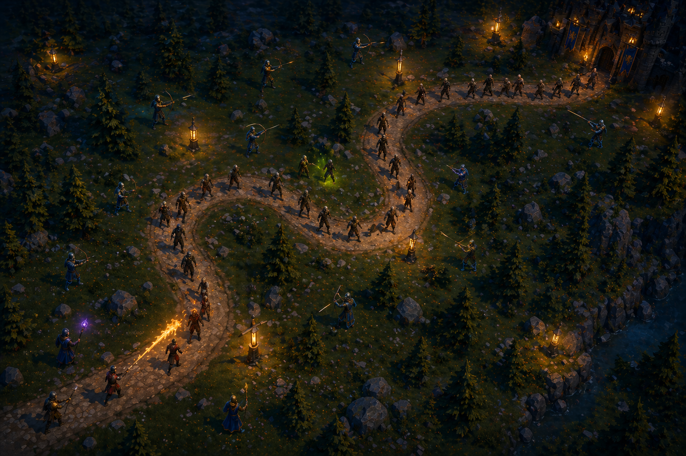
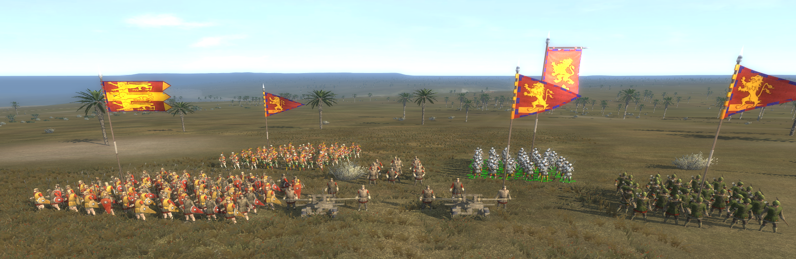

# Especificação da Implementação

## Integrantes da dupla

- **Aluno 1 - Nome**: Caetano Meneghetti
- **Aluno 1 - Cartão UFRGS**: 00591004

- **Aluno 2 - Nome**: Fernando Tedesco
- **Aluno 2 - Cartão UFRGS**: 00591001

## Detalhes do que será implementado

- **Título do trabalho**: 1346AD: Iron & Blood
- **Parágrafo curto descrevendo o que será implementado**: O trabalho será um jogo 3D no estilo tower defense (mecânicas inspiradas no Bloons TD 6) com a temática medieval. O cenário será baseado em assets com malhas poligonais complexas baseado no jogo Total War: Medieval II. O jogador terá a função lançar feitiços e posicionar unidades aliadas a fim de defender um castelo de ondas/hordas de inimigos. A aplicação vai simular o avanço de tropas inimigas por rotas pré-definidas e animações baseadas na velocidade de cada inimigo. O combate será gerido pela intersecção de elementos como projéteis (flechas e balas) e espadas, onde cada aliado e inimigo possui suas características e habilidades, possibilitando criar variações com inimigos mais fortes para criar fases mais difíceis.

## Especificação visual

### Vídeo

Como estamos criando um jogo do zero, não conseguimos utilizar um vídeo de referência. Portanto, fizemos um vídeo utilizando ferramentas de IA que reflete bem o que desejamos implementar. O vídeo está dentro da pasta "Spec", e tem o nome de "demo_ia_tower_defense.mp4".
Por limitação das ferramentas, só conseguímos gerar um vídeo com resultado satisfatório de 10 segundos.

Abaixo seguem vídeos auxiliares, mas o vídeo principal e que reflete o que queremos fazer é o dito acima.

#### Vídeo auxiliar - link e timestamp

Uma ideia geral do jogo pode ser vista em vídeos das fases simples de Bloons TD 6, como em
https://www.youtube.com/watch?v=gBeI4md2ixE&t=189s, no minuto **2:00**. A temática será bem diferente, seguindo o jogo Total War: Medieval II como referência gráfica. As imagens exemplificam melhor isso.

### Imagens

Imagem 1 - Mecânicas e funcionalidades:

Imagem 2 - Cenário principal:

Imagem 3:
Meshes e texturas das unidades aliadas que serão utilizadas. No nosso jogo, cada entidade será de um tipo diferente (extraídas do jogo Total War: Medieval II).

## Especificação textual

### Malhas poligonais complexas
A grande maioria das malhas poligonais utilizadas no jogo serão extraídas do jogo Total War: Medieval II. o processo consiste em converter os arquivos binários de mesh do próprio jogo (.mesh) para formatos legíveis ao blender (.glb) por meio de ferramentas da comunidade (IWTE), possibilitando a manipulação das malhas e texturas no blender, para que no fim seja possível animar, além de manualmente no próprio blender, com ferramentas do tipo Mixamo e Accurig. Os arquivos finais, do tipo .fbx, serão lidos e interpretados por meio de um parser de uma lib (Assimp ou Autodesk FBX SDK).

### Transformações geométricas controladas pelo usuário
O jogador usará o mouse para mover um modelo 3D da unidade "fantasma" antes de posicionar ela no campo de batalha, com as coordenadas X,Z atualizadas constantemente. Também será possível a rotação de construções e unidade em torno do seu eixo Y.

### Diferentes tipos de câmeras
O jogo terá uma câmera look-at orbital para abrir o HUD de uma unidade específica, uma câmera livre para visualização do cenário e uma câmera look-at fixa em cima do cenário para o jogador desenhar feitiços.

### Instâncias de objetos
Teremos os objetos das entidades aliadas (múltiplas instâncias, 5 entidades diferentes), objetos das entidades inimigas (múltiplas instâncias, 5 entidades de inimigos diferentes), e os objetos do cenário (chão, terra, árvores, pedras, etc.) e objetos de iluminação (fontes de luz como tochas e fogo)

### Testes de intersecção
Será utilizado o método bounding-box para a checagem de colisão entre os inimigos e projéteis, e também para checar se o inimigo chegou em uma distância de combate com aliados.

### Modelos de Iluminação em todos os objetos
Será utilizado o termo especular (Blinn-Phong), termo ambiente e termo difuso (Lambert).

### Mapeamento de texturas em todos os objetos
Os modelos 3D dos soldados terão texturas  mapeadas para reprentar detalhes como a malha de aço da armadura, brasões de nações, e outras características. As texturas serão extraídas de maneira semelhante as malhas poligonais (arquivo .texture do jogo alvo -> .dds -> .png), o mapeamento UV dos assets é desconexo, portanto, será realizado o mapeamento e configuração manual da textura para o modelo (Atualização: No caso, o mapeamento da malha poligonal dos models para textura é extraído, sendo necessário apenas a translação e algumas vezes modificação de escala da malha 2D do mapeamento que já está pronta.)

### Movimentação com curva Bézier cúbica
Serão utilizadas curvas de Catmull-Rom para definir o caminho padrão que os inimigos devem traçar até o objetivo.

### Animações baseadas no tempo ($\Delta t$)
Os inimigos terão movimentação com velocidade fixa ao longo do caminho definido pelas curvas, seguindo a especificação do trabalho de atrelar a velocidade das animações a um valor Δt fixo.

## Limitações esperadas

**Serão feitas parcialmente** as seguintes funcionalidades presentes na documentação visual:
- Partículas (Podem ser implementadas como efeitos simples de texturas fixas e triviais, mas não será algo avançado a ponto de ser um dos principais elementos visuais do jogo como na imagem e vídeo)
**Não serão feitas** as seguinte funcionalidades presentes na documentação visual:
- As texturas e meshes do jogo serão extraídas do jogo Total War: Medieval II, portanto, o estilo visual do jogo será diferente e não cartoon/low poly como está nas imagens e vídeo.
- O caminho dos inimigos será feito de terra ao invés de pedras, como está nas imagens e vídeo.
- Os feitiços serão desenhados no mapa do jogo e não em um lugar qualquer como na imagem 1, célula 9.
- Não vai ter uma unidade que utiliza um lança-chamas (as unidades terão arcos, armas ou espadas)

## Atualização
Colocamos a pasta models e textures no .gitignore para a avaliação parcial devido a questão da licença dos models.

Read.me atualizado com instruções de extração dos models do jogo.

Em relação ao mapeamento UV, os models extraidos já vem com a malha de poligonos para a textura, sendo necessário apenas a translação simples na aba de UV maping no Blender.